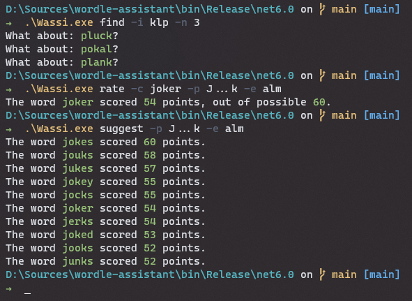

# Wassi CLI

## Introduction
Wordle is currently abundant, and I have dabbled with it every now and then again. Last weekend I got a bit bored and felt the itch to write some F# again. I had also wanted to try using Spectre.Console in F# for a while. So writing a small CLI that assists me with the game of wordle seemed like a fun idea. 

## Disclaimer
This is just a fun project. It uses a very naive counting strategy to rank words. I know there are many better tools out there that take this more seriously. I purposely didn't look at any of them, nor did I want to spend more than a day figuring this out. 

## Wassi.CLI
Wassi (short for Wordle-assistant) uses [Spectre.Console](https://github.com/spectreconsole/spectre.console) and works command-based. It currently has two commands. 

### Suggest
The suggest command will suggest words, ranked by their score, that fit your current _progress_ and the letters you have already _excluded_. This is an example of a usage:
```PS
.\Wassi.exe suggest -p .A..s -e kltd -n 7
````
The parameter
* -p defines the progress. Has to be a five character string. Capital letters inidcate exact hits (green in wordle), lower-case letters occurrences in the word atr the wrong position (yellow in wordle). If this parameter is omitted, it is interpreted as the starting point.
* -e provides the excluded letters as a gap-less string. If this parameter is omi
* -w provides a path to a file containing the words to be used (default: "./word-lists/words.txt").  
* -n indicates the number of results to be shown (default: 10).

### Find
The find command helps you find a word containing given letters, which can be helpful if you want to eliminate multiple ones but can't think of a word containing them.
```PS
.\Wassi.exe find -c cko
````
Here, the parameter -c provides the letters that should be included. Both -w for providing the word list as well as -n for the amount of results can be used with this command as well.

### Sample
Here is a small sample Wassi in action. It is based on the word list that can be [found here](https://github.com/tabatkins/wordle-list).



## Feedback and Contributing
All feedback welcome!
All contributions are welcome!
